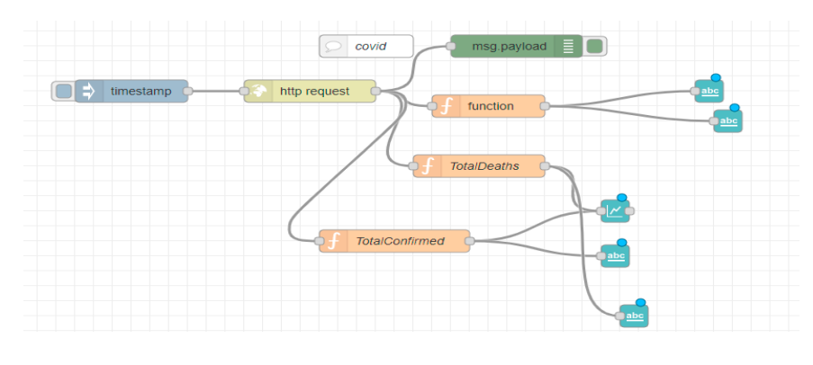

# Node-RED-Dashboard
The main goal of this project is to develop an interactive and dynamic platform that allows Moroccan citizens to consult open data containing information about the various primary sectors and services that enter into their daily lives.

This project is a collection of nodes for Node-RED to quickly create a live data dashboard. The dashboard uses various nodes to collect data from APIs and other sources and displays it in real-time on a web page.

# Prerequisites:
+ Node-RED
+ Node-RED Dashboard

# Installation Instructions:
1. Install Node-RED
2. Install the Node-RED Dashboard using the Node-RED Palette Manager
3. Clone or download the project from GitHub
4. Import the provided flow in Node-RED
5. Configure the nodes as per the instructions provided in the flow
6. Deploy the flow
7. Access the dashboard by opening the URL provided by Node-RED

# Usage Instructions:
+ The dashboard displays the data from APIs and other sources in real-time.
+ Users can customize the dashboard by editing the provided flow or adding their own nodes.

# Excerpts from work done
## Map Flow :

## Weather Flow :

## Covid Flow :

## Economy Flow :

# The result : 
https://user-images.githubusercontent.com/80436572/215017226-8cca49a9-b32f-4e48-92ef-918ebda4b233.mp4

https://user-images.githubusercontent.com/80436572/215017299-04fc51eb-bb95-4de1-a795-6b35d3ffe329.mp4

https://user-images.githubusercontent.com/80436572/215017356-60cb6d06-c747-40bb-b8ab-d5f5a13988fe.mp4

https://user-images.githubusercontent.com/80436572/215017523-f6456c70-d145-4ede-b7f1-fe294d16c8fc.mp4

## Contact :busts_in_silhouette:
Feel free to reach out to us if you have any questions or suggestions:

**Chaimae BOUYARMANE**

 

